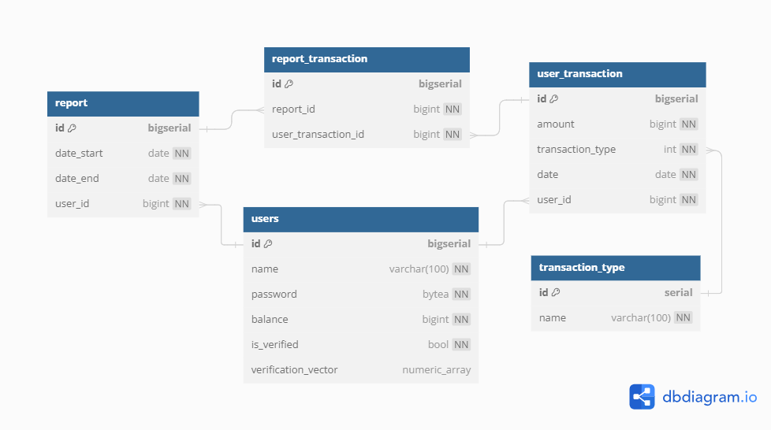

# APIGateway

Этот сервис является точкой входа для обращения к другим.

| Method | Path                            | Description              |
| ------ | ------------------------------- | ------------------------ |
| GET    | /api/api-gateway/healthz/ready/ | Проверка статуса сервиса |

## Методы для обращения к другим сервисам

### Auth service

Сервис содержит апи для регистрации и аунтификации пользователя. Также позволяет отправить фото пользователя на верификацию передав сообщение через kafka.

| Method | Path                           | Description                        |
| ------ | ------------------------------ | ---------------------------------- |
| POST   | /api/auth-service/register/    | Регистрация пользователя           |
| POST   | /api/auth-service/auth/        | Получение или обновление токена    |
| GET    | /api/auth-service/check_token/ | Проверка токена на валидность      |
| POST   | /api/auth-service/verify/      | Подтверждение пользователя по фото |

### Transaction service

Сервис содержит api для создания транзакций и получения списка транзакций за определённый промежуток времени.

| Method | Path                             | Description                    |
| ------ | -------------------------------- | ------------------------------ |
| POST   | /api/transaction-service/create/ | Создание транзакции            |
| POST   | /api/transaction-service/report/ | Получение отчёта о транзакциях |

### Face verification service

Сервис содержит api для верификации фотографии пользователя. Также сервис взаимодействует с кафкой, откуда также может принимать запросы на верификацию.

| Method | Path                                       | Description                                    |
| ------ | ------------------------------------------ | ---------------------------------------------- |
| GET    | /api/face-verification-service/get_vector/ | Получение векторного представления изображения |

## Инфраструктура


### Redis

Редис используется для хранения ранее полученной информации из базы, тем самым снижая на неё нагрузку.

### Postgresql

База данных Postgresql хранит в себе всю информацию, чувствительную к потере.



### Kafka

Кафка принимает сообщения из сервиса auth, которые содержат путь до изображения. 
Эти сообщения потребляет сервис face-verification.

## Инструкция по запуску

### Перед началом

* Установить docker

### Запуск

```bash
docker compose build
docker compose up
```

### Важные эндпоинты *
* [http://localhost:8000/docs](http://localhost:8000/docs) - Gateway
* [http://localhost:8001/docs](http://localhost:8001/docs) - Auth
* [http://localhost:8002/docs](http://localhost:8002/docs) - Transaction
* [http://localhost:8003/docs](http://localhost:8003/docs) - Face verification

* [http://localhost:9090](http://localhost:9090) - Веб интерфейс Prometheus
* [http://localhost:16686](http://localhost:16686) - Веб интерфейс Jaeger

## Развёртывание в kubernetes

### Порядок развёртывания

1. Transaction
2. Auth
3. Face-Verification
4. ApiGateway

### Продакшен

```bash
cd helm/api-gateway
helm install my-release-name .
```

### Тестирование

```bash
cd helm/api-gateway
helm install my-release-name --values ./values/test.yaml
```